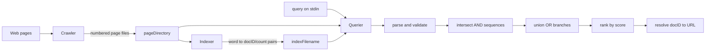

# Tiny Search Engine Querier

This repository contains the query-processing component of a Dartmouth CS50 Tiny Search Engine (TSE) project. It implements ranked Boolean retrieval over crawler and indexer output; it is **not a standalone search engine repository**.

## The search problem

Given crawled pages and an inverted index, the querier accepts search terms, finds documents containing the requested term combinations, scores them, and prints matching URLs in ranked order. It does not crawl pages or construct an index.

## Pipeline and inputs



The executable requires:

- `pageDirectory`: a crawler-produced directory with a `.crawler` marker and files named by positive document ID. The first line of each page file is its URL.
- `indexFilename`: an indexer-produced serialized inverted index, conceptually mapping each normalized word to `docID → occurrence count` counters.

The external `common/index` module owns the index-file format. This repository neither defines nor generates it.

## Query grammar

Queries contain alphabetic words, whitespace, and the case-insensitive operators `and` and `or`. Input is normalized to lowercase. Any other character rejects the line.

```text
query       := andSequence { "or" andSequence }*
andSequence := word { ["and"] word }*
```

Adjacent words imply AND: `alpha beta` equals `alpha and beta`. AND binds more tightly than OR, so `alpha or beta gamma` means `alpha or (beta and gamma)`. Operators may not be first or last, and two operators may not be adjacent.

## Evaluation, scoring, and ranking

For an AND sequence, the querier copies the first term's counters and intersects later terms. A document survives only when every term is present; its group score is the minimum term count:

```text
score(alpha and beta, doc) = min(count(alpha, doc), count(beta, doc))
```

OR unions complete AND-sequence results by addition:

```text
score(groupA or groupB, doc) = score(groupA, doc) + score(groupB, doc)
```

Positive results are sorted by descending score. The current comparator has no tie-breaker, so equal-scoring documents may appear in any order. Each document ID is resolved by opening `pageDirectory/<docID>` and reading its first line. An unreadable page file is displayed as `(no-url)`.

## Build requirements

The makefile expects this directory to be the `querier/` child of a complete TSE tree with:

- GCC or a compatible C11 compiler, POSIX interfaces, `make`, and Bash;
- `../libcs50/libcs50.a` plus `counters.h` and `mem.h`;
- `../common/common.a`, `index.h`, and the expected index implementation;
- crawler data and a compatible indexer-produced index for runtime tests;
- optionally Valgrind for `make valgrind`.

These course-provided dependencies and datasets are intentionally not copied here. They are absent in this checkout, so it cannot build independently.

In a compatible full TSE tree, the intended commands are:

```bash
make
./querier pageDirectory indexFilename
make test
make valgrind
```

The current test script rebuilds the parent tree and uses course-specific fixture paths. See [CODE_AUDIT.md](CODE_AUDIT.md) before relying on these commands.

## Testing approach

`testing.sh` exercises argument-count errors, invalid paths, basic queries, redirected-input prompt suppression, illegal characters, and malformed operators. It does not assert exact document sets, scores, ordering, long-line behavior, memory safety, or index-load failures.

A complete-tree verification should compile with strict warnings, run deterministic fixture-based result tests, cover implicit AND and precedence, exercise long input and failure paths, and use Valgrind or sanitizers.

## Repository structure

```text
.
├── querier.c          # parsing, evaluation, ranking, and URL lookup
├── makefile           # full-tree-oriented build and test targets
├── testing.sh         # Bash smoke tests
├── DESIGN.md          # design contract
├── IMPLEMENTATION.md  # source-level notes
├── CODE_AUDIT.md      # correctness and dependency audit
└── README.md          # case study and usage guide
```

## Limitations

- This checkout is not standalone and requires the API-compatible TSE `libcs50` and `common` modules.
- It requires crawler page files and indexer output; it creates neither.
- There are no phrases, parentheses, negation, stemming, or fielded searches.
- A fixed 1024-byte input buffer causes an overlong physical line to be processed as multiple queries.
- URLs longer than the fixed buffer can be silently truncated.
- Equal scores have no deterministic tie-breaker.
- Allocation, path truncation, integer overflow, index-load, and exit-status concerns remain unmodified because the dependencies needed to compile and test the C component are missing. See [CODE_AUDIT.md](CODE_AUDIT.md).
